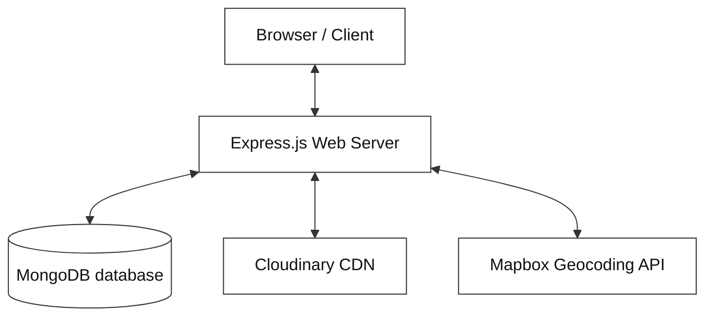
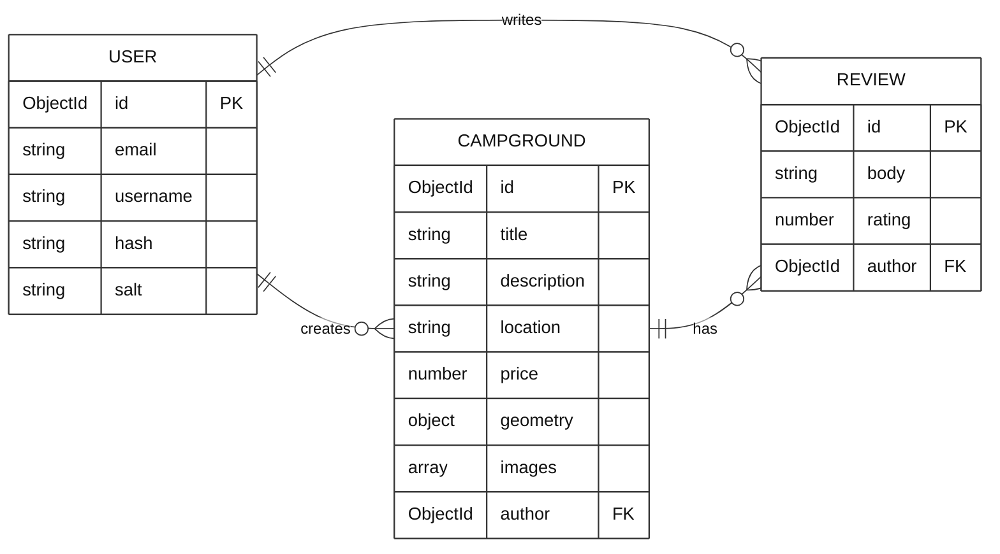
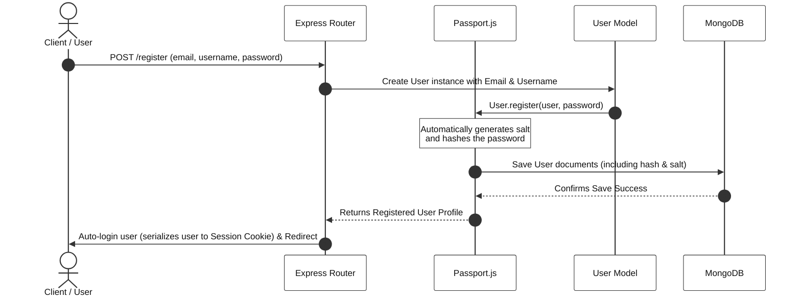
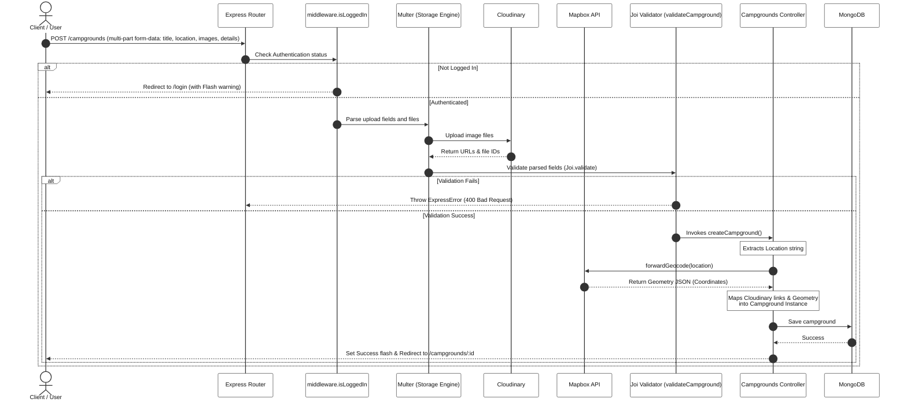
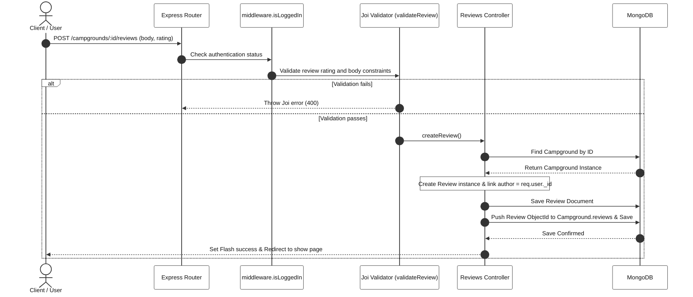
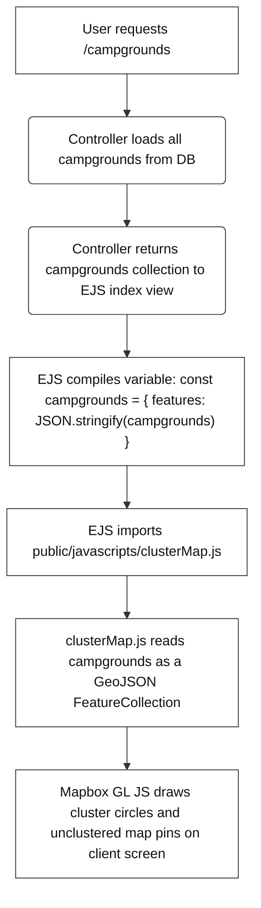

# YelpCamp Architecture & Data Flow Guide

Welcome to the comprehensive architecture and design reference for **YelpCamp**. This document details the application's overall system design, technology stack, directory organization, database models, security features, and interactive data flow processes.

---

## 1. System Overview

YelpCamp is a full-stack, server-side rendered (SSR) web application where users can share, review, and view campgrounds around the world. It is built following the traditional **Model-View-Controller (MVC)** architectural pattern using **Node.js** and **Express**.

The system integrates with cloud databases, object storage providers, maps, and geocoding services:

---

## 2. Technology Stack

The application's technical stack is organized into distinct functional layers:

| Layer | Component / Tool | Technology / Package | Purpose |
| :--- | :--- | :--- | :--- |
| **Server Engine** | Web Framework | `express` | Handles Routing, HTTP Requests, Middleware, and Controllers |
| **Database** | Database Engine | `MongoDB` | Document-oriented database for flexible schema models |
| | Object Data Modeler (ODM) | `mongoose` | Schema definitions, validation, hooks, and queries |
| | Session Storage | `connect-mongo` | Persists session cookies in MongoDB instead of in-memory |
| **View Template** | View Engine | `ejs` & `ejs-mate` | Embedded Javascript templates with page inheritance layouts |
| | Maps | `Mapbox GL JS (v1.12.0)` | Renders interactive maps on the client side |
| **Authentication** | Authentication Engine | `passport` | Middleware to handle login sessions and requests |
| | Local Strategy | `passport-local` | Authenticates users against username/password in database |
| | Mongoose Plugin | `passport-local-mongoose` | Automates hashing, salting, and security fields on User model |
| **Cloud Services** | Image CDN | `cloudinary` | Stores user-uploaded campgrounds images |
| | Map Service | `@mapbox/mapbox-sdk` | Forward geocoding of location strings (e.g. "Paris" to coordinates) |
| | Multi-part Uploads | `multer` & `multer-storage-cloudinary` | Parses file forms and pipes files directly to Cloudinary |
| **Security & Validation** | Content Security Policy | `helmet` | Sets HTTP response headers to prevent XSS, clickjacking |
| | Input Validation | `joi` | Validates req.body schema limits on server side |
| | HTML Sanitization | `sanitize-html` | Trims out script tags and HTML injection vectors from text |
| | Injection Prevention | `express-mongo-sanitize` | Strips out characters starting with `$` or `.` from query objects |

---

## 3. Architecture & Code Structure (MVC)

YelpCamp strictly implements the **Model-View-Controller (MVC)** pattern to separate concern layers:

- **Routing Layer (`/routes`)**: Intercepts HTTP requests, validates permissions (e.g. authentication, author authorization), applies request body validations via Joi schemas, and maps URLs to controller logic.
- **Controller Layer (`/controllers`)**: Performs the core business workflows, queries database schemas via Mongoose, interfaces with external APIs (Mapbox and Cloudinary), populates views with data payload, and triggers SSR view rendering.
- **Model Layer (`/models`)**: Defines schema properties, specifies database validation parameters, embeds virtual fields, and handles lifecycle hooks (like cascade deleting campground reviews).
- **View Layer (`/views`)**: Server-side templates containing HTML structured with Embedded JavaScript (EJS). Extends standard layouts (boilerplate) and includes reusable partials (navbars, flash alerts).

### Directory Breakdown
- [app.js](file:///c:/Users/KIIT0001/Desktop/YelpCamp/app.js): Main setup, configuration, database connection, middleware orchestration
- [middleware.js](file:///c:/Users/KIIT0001/Desktop/YelpCamp/middleware.js): Global permission-checking and authorization middlewares
- [schemas.js](file:///c:/Users/KIIT0001/Desktop/YelpCamp/schemas.js): Joi schemas for server-side body validation and sanitation
- [cloudinary/](file:///c:/Users/KIIT0001/Desktop/YelpCamp/cloudinary/): Cloudinary configuration and storage connection configuration
- [controllers/](file:///c:/Users/KIIT0001/Desktop/YelpCamp/controllers/): MVC Controllers containing backend business workflows
- [models/](file:///c:/Users/KIIT0001/Desktop/YelpCamp/models/): Mongoose DB schema definitions
- [routes/](file:///c:/Users/KIIT0001/Desktop/YelpCamp/routes/): Express route parameters and method routes
- [seeds/](file:///c:/Users/KIIT0001/Desktop/YelpCamp/seeds/): Local seed datasets and script to initialize database state
- [utils/](file:///c:/Users/KIIT0001/Desktop/YelpCamp/utils/): Error wrappers and async exception handlers
- [public/](file:///c:/Users/KIIT0001/Desktop/YelpCamp/public/): Static frontend scripts, styles, and image resources
- [views/](file:///c:/Users/KIIT0001/Desktop/YelpCamp/views/): EJS pages, layouts, and partial templates

---

## 4. Database Architecture & Relationships

YelpCamp uses MongoDB as its primary persistence store. Below is the Entity-Relationship (ER) model and schema specification:

### Entity-Relationship Diagram

---

### Detailed Schema Specifications

#### A. Campground Model ([campground.js](file:///c:/Users/KIIT0001/Desktop/YelpCamp/models/campground.js))

Tracks details of user-submitted campgrounds, including geocoded location, image links, owner, and review collections.

| Field Name | Data Type | Relationships / Description | Notes |
| :--- | :--- | :--- | :--- |
| `_id` | `ObjectId` | Primary Key | Auto-generated by MongoDB |
| `title` | `String` | Required | validated on submit |
| `description` | `String` | Required | validated on submit |
| `location` | `String` | Textual description of campground location | E.g. "Yosemite Valley, CA" |
| `price` | `Number` | Price per night | Minimum 0 validation |
| `geometry` | `Object` | GeoJSON representation of coordinates | Mapped to `Point` coordinates: `[longitude, latitude]` for maps |
| `images` | `Array` | List of `ImageSchema` | Images upload to Cloudinary. Each has a URL and a Cloudinary filename |
| `author` | `ObjectId` | Reference $\rightarrow$ `User` | Links to campground creator |
| `reviews` | `Array` | References $\rightarrow$ `[Review]` | Array of Review ObjectIds linked to this campground |

* **Virtuals**:
  - `images[].thumbnail`: Generates a modified Cloudinary URL specifying width parameters (`w_200`) dynamically on query.
  - `properties.popUpMarkup`: Constructs a clickable raw HTML tag (`<a href="/campgrounds/ID">Title</a>`) embedded in campground data for Mapbox interactive cluster map popup window.
* **Mongoose Hooks**:
  - `post('findOneAndDelete')`: Automatically triggers when a Campground is deleted. Performs a cascade delete, purging all linked reviews from the reviews collection in the database.

---

#### B. Review Model ([review.js](file:///c:/Users/KIIT0001/Desktop/YelpCamp/models/review.js))

Represents a review added to a campground.

| Field Name | Data Type | Relationships / Description | Notes |
| :--- | :--- | :--- | :--- |
| `_id` | `ObjectId` | Primary Key | Auto-generated |
| `body` | `String` | Content of the review | Sanitized to prevent HTML injections |
| `rating` | `Number` | Score from 1 to 5 | Required |
| `author` | `ObjectId` | Reference $\rightarrow$ `User` | Owner of this specific review |

---

#### C. User Model ([user.js](file:///c:/Users/KIIT0001/Desktop/YelpCamp/models/user.js))

Represents user accounts, authenticated via `passport-local-mongoose`.

| Field Name | Data Type | Relationships / Description | Notes |
| :--- | :--- | :--- | :--- |
| `_id` | `ObjectId` | Primary Key | Auto-generated |
| `email` | `String` | Unique, Required | Used for registration and credentials verification |
| `username` | `String` | Unique | Added automatically by Passport plugin |
| `hash` | `String` | Hashed password digest | Added automatically by Passport plugin |
| `salt` | `String` | Security salt buffer | Added automatically by Passport plugin |

---

## 5. Security & Request Validation

YelpCamp implements multi-tier security boundaries on incoming data, session persistence, and headers:

1. **Strict Input Sanitation & Schema Validation ([schemas.js](file:///c:/Users/KIIT0001/Desktop/YelpCamp/schemas.js))**:
   - Integrated `Joi` validation schemas on all campgrounds and reviews creations/updates.
   - Built custom `Joi` extension running `sanitize-html` to block and strip out HTML injections (`<script>` elements) from any string body parameters.
2. **MongoDB Injection Protection (`express-mongo-sanitize`)**:
   - Intercepts requests and replaces any user queries containing illegal characters (`$` or `.`) with an underscore `_` to block MongoDB injection exploits.
3. **Secure Persistent Sessions (`connect-mongo` + `express-session`)**:
   - Instead of storing server-session variables in-memory (which creates memory leaks), it serializes them directly to a session database collection in MongoDB using `connect-mongo`.
   - Cookie setup includes `httpOnly: true` (restricts Javascript from accessing cookies to prevent XSS session theft) and configures automatic cookie expiry.
4. **Header and CSP Security (`helmet`)**:
   - Initializes 15 middlewares under `helmet()` to set standard headers (strict-transport-security, dns-prefetch-control, x-content-type, etc.).
   - Configures a restrictive **Content Security Policy (CSP)** specifying strict white-listed source domains (such as `api.mapbox.com` and `res.cloudinary.com`) to block cross-site execution vectors.

---

## 6. End-to-End Data Flow Diagrams

The following charts outline the request and processing flows inside the application.

### A. User Authentication Flow
Demonstrates registration, hashing verification, and user session storage.

---

### B. Campground Creation Flow
Illustrates form parsing, multi-destination upload (Cloudinary and Mapbox), database persistence, and views updates.

---

### C. Review Creation Flow
Highlights review submission, association with campgrounds, and data population.

---

## 7. Dynamic UI & Maps Binding Flow

To render client-side maps with live server-side database records, YelpCamp maps Mongoose queries to frontend JavaScript scripts:

